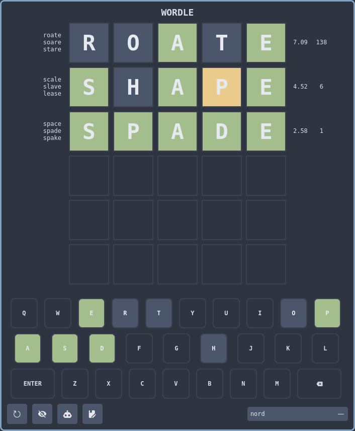

# wordle-qt

A Wordle clone built with Qt6.

# Requirements

`python3`

`PyQt6`

`wordfreq`

`nerdfonts` (for icons)

# Usage

1. Clone this repository.

    ```
    $ git clone https://github.com/sotormd/wordle-qt
    $ cd wordle-qt
    ```

2. Install requirements.

    ```
    $ python3 -m venv venv
    $ source venv/bin/activate
    (venv) $ python3 -m pip install -r requirements.txt
    ```

3. Run `main.py`.

    ```
    (venv) $ python3 main.py
    ```

OR, use the `start.sh` wrapper that does everything.

```
$ chmod +x start.sh
$ ./start.sh
```

# Features

- [x] Functional wordle implementation
- [x] Calculate bits of information gained per guess
- [x] Show best guesses
- [x] Autoplay best guesses
- [x] Play a custom word
- [x] Themes
- [ ] Graph insights

# Showcase

<div align="center">
  
</div>

