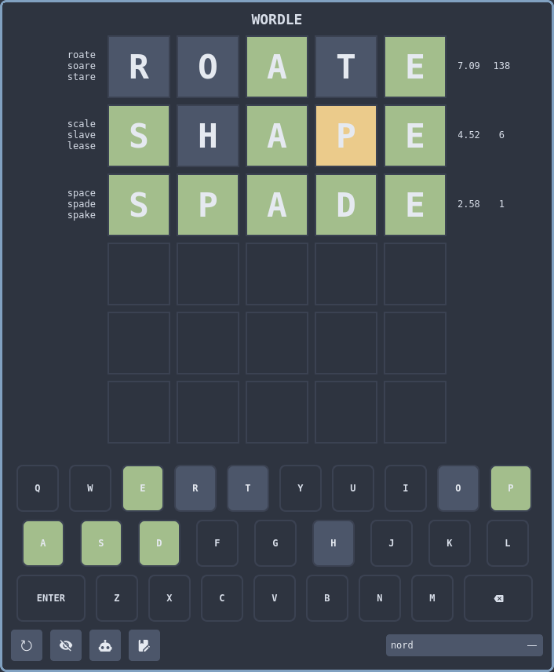

# wordle-qt

A Wordle clone built with Qt6.

# Usage

```bash
nix run github:sotormd/wordle-qt
```

# Features

- [x] Functional wordle implementation
- [x] Calculate bits of information gained per guess
- [x] Show best guesses
- [x] Autoplay best guesses
- [x] Play a custom word
- [x] Themes
- [ ] Graph insights

# Showcase

<div align="center">
  
</div>
